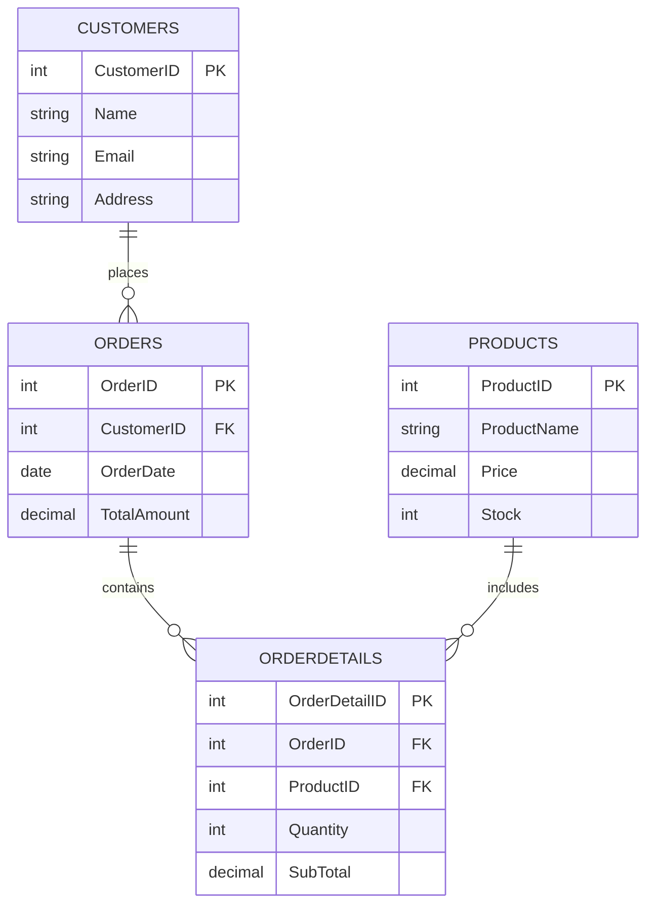

# 📊 Data Digger
---
## 🎯 Objective

**Data Digger** is a practical SQL project built to provide hands-on experience in managing a **MySQL database** for an **E-Commerce Store**. It covers:

- ✅ CRUD Operations (Create, Read, Update, Delete)
- ✅ Clauses (`WHERE`, `ORDER BY`, `BETWEEN`, etc.)
- ✅ Operators (comparison & logical)
- ✅ Aggregate Functions (`SUM`, `COUNT`, `MAX`, `MIN`, `AVG`)
- ✅ Primary Keys & Foreign Keys
- ✅ Relational Database Design

The goal is to design and manipulate a structured relational database to gain deeper insight into real-world SQL query execution.

---

## 🗂️ Project Scope

This project works across **four interconnected relational tables**, simulating a real e-commerce backend:

| # | Table | Purpose |
|---|-------|---------|
| 1️⃣ | **Customers** | Stores customer information |
| 2️⃣ | **Orders** | Tracks orders placed by customers |
| 3️⃣ | **Products** | Manages product catalog & inventory |
| 4️⃣ | **OrderDetails** | Bridges Orders & Products (line items) |

---

## 🧬 Database Schema

<details>
<summary><b>📄 Click to view full schema (SQL)</b></summary>

```sql
CREATE TABLE Customers (
    CustomerID INT PRIMARY KEY AUTO_INCREMENT,
    Name       VARCHAR(100) NOT NULL,
    Email      VARCHAR(100) UNIQUE NOT NULL,
    Address    VARCHAR(255)
);

CREATE TABLE Orders (
    OrderID     INT PRIMARY KEY AUTO_INCREMENT,
    CustomerID  INT,
    OrderDate   DATE NOT NULL,
    TotalAmount DECIMAL(10,2),
    FOREIGN KEY (CustomerID) REFERENCES Customers(CustomerID)
);

CREATE TABLE Products (
    ProductID   INT PRIMARY KEY AUTO_INCREMENT,
    ProductName VARCHAR(100) NOT NULL,
    Price       DECIMAL(10,2) NOT NULL,
    Stock       INT DEFAULT 0
);

CREATE TABLE OrderDetails (
    OrderDetailID INT PRIMARY KEY AUTO_INCREMENT,
    OrderID       INT,
    ProductID     INT,
    Quantity      INT NOT NULL,
    SubTotal      DECIMAL(10,2),
    FOREIGN KEY (OrderID) REFERENCES Orders(OrderID),
    FOREIGN KEY (ProductID) REFERENCES Products(ProductID)
);
```

</details>

---

## 🔗 Entity Relationship Diagram



---

## 📊 Tables & Queries

### 1️⃣ Customers Table

**Fields:** `CustomerID` · `Name` · `Email` · `Address`

| ✅ | Query Task |
|----|-----------|
| ✔️ | Insert at least 5 sample customers into the Customers table |
| ✔️ | Retrieve all customer details |
| ✔️ | Update a customer's address |
| ✔️ | Delete a customer using their `CustomerID` |
| ✔️ | Display all customers whose name is `'Alice'` |

---

### 2️⃣ Orders Table

**Fields:** `OrderID` · `CustomerID` · `OrderDate` · `TotalAmount`

| ✅ | Query Task |
|----|-----------|
| ✔️ | Insert at least 5 sample orders into the Orders table |
| ✔️ | Retrieve all orders made by a specific customer |
| ✔️ | Update an order's total amount |
| ✔️ | Delete an order using its `OrderID` |
| ✔️ | Retrieve orders placed in the last 30 days |
| ✔️ | Retrieve the highest, lowest, and average order amount using aggregate functions |

---

### 3️⃣ Products Table

**Fields:** `ProductID` · `ProductName` · `Price` · `Stock`

| ✅ | Query Task |
|----|-----------|
| ✔️ | Insert at least 5 sample products into the Products table |
| ✔️ | Retrieve all products sorted by price in descending order |
| ✔️ | Update the price of a specific product |
| ✔️ | Delete a product if it's out of stock |
| ✔️ | Retrieve products whose price is between ₹500 and ₹2000 |
| ✔️ | Retrieve the most expensive and cheapest product using `MAX()` and `MIN()` |

---

### 4️⃣ OrderDetails Table

**Fields:** `OrderDetailID` · `OrderID` · `ProductID` · `Quantity` · `SubTotal`

| ✅ | Query Task |
|----|-----------|
| ✔️ | Insert at least 5 sample records into the OrderDetails table |
| ✔️ | Retrieve all order details for a specific order |
| ✔️ | Calculate the total revenue generated from all orders using `SUM()` |
| ✔️ | Retrieve the top 3 most ordered products |
| ✔️ | Count how many times a specific product has been sold using `COUNT()` |

---

## 🧠 Concepts Covered

<div align="center">

| Concept | Description |
|---------|-------------|
| 🔑 **Primary Keys** | Uniquely identify each record in a table |
| 🔗 **Foreign Keys** | Establish relationships between tables |
| 🧮 **Aggregate Functions** | `SUM()`, `COUNT()`, `MAX()`, `MIN()`, `AVG()` |
| 🧩 **CRUD Operations** | Insert, Select, Update, Delete |
| 🔍 **Clauses & Operators** | `WHERE`, `BETWEEN`, `ORDER BY`, `LIKE` |
| 📈 **Data Analysis** | Revenue calculation & top-product ranking |

</div>

---

## 📁 Project Structure

```
data-digger/
├── README.md            # Project documentation (this file)
├── schema.sql           # Table creation scripts (DDL)
├── queries.sql          # All CRUD & aggregate queries (DML)
├── sample_data.sql       # Sample INSERT statements
└── assets/
    └── er-diagram.png   # Exported ER diagram (optional)
```

---

## 💡 Sample Query Snippets

```sql
-- Display all customers whose name is 'Alice'
SELECT * FROM Customers WHERE Name = 'Alice';

-- Retrieve products priced between ₹500 and ₹2000
SELECT * FROM Products WHERE Price BETWEEN 500 AND 2000;

-- Total revenue generated from all orders
SELECT SUM(TotalAmount) AS TotalRevenue FROM Orders;

-- Top 3 most ordered products
SELECT P.ProductName, SUM(OD.Quantity) AS TotalSold
FROM OrderDetails OD
JOIN Products P ON OD.ProductID = P.ProductID
GROUP BY P.ProductName
ORDER BY TotalSold DESC
LIMIT 3;
```

---
## 🎬 Project Demonstration
  <a href="https://drive.google.com/file/d/1c3dRykXo2lzeaDmnd0ruaEPVolfaKB4g/view?usp=sharing">
    
  </a>
</p>

---
